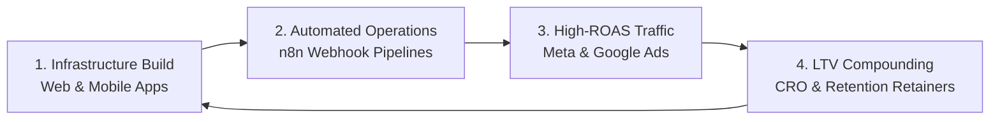

# Penguin Tech Limited — Official Web & Growth Platform

> **Architecting Your Digital Future.**  
> Premium Technology & Growth Agency — Web Engineering, Cross-Platform Mobile Apps & High-ROAS Performance Marketing.

---

## 🚀 Agency Overview & Service Pillars

**Penguin Tech Limited** is an elite technology and client growth agency. We engineer mission-critical digital platforms and scale them into market leaders through automated data-driven marketing systems.

### 🌐 Pillar 1: Web Design & Engineering
* **High-Converting Landing Pages:** Sub-second loading speed, conversion-optimized design, dynamic lead capture.
* **E-Commerce Platforms:** Multi-currency checkout, automated inventory sync, high-throughput architectures.
* **Corporate Platforms:** Dynamic headless CMS, enterprise-grade security, CRM webhook integrations.

### 📱 Pillar 2: Mobile Application Development
* **Cross-Platform Applications:** High-performance iOS and Android builds powered by React Native and Flutter.
* **Bespoke Business Logic:** On-demand booking systems, customer loyalty engines, and internal ERP workflows.
* **Elite UI/UX Product Design:** Design systems, interactive Figma prototypes, and user retention loops.

### 📈 Pillar 3: Digital Marketing & Performance Growth
* **Meta & Google Ads Management:** High-velocity creative testing, server-side Conversions API (CAPI) telemetry, and 3.5x–7.2x target ROAS.
* **Social Media Management:** High-end motion reels, technical brand authority, and active community growth.
* **Conversion Rate Optimization (CRO):** Systematic A/B testing, heatmap tracking, and checkout funnel optimization.

---

## ⚡ The Penguin Ecosystem Flywheel



---

## 🛠️ Technology Stack & Operational Tools

* **Frontend & Core:** HTML5, Modern ES6+ JavaScript, Tailwind CSS, Google Fonts (Space Grotesk & Plus Jakarta Sans).
* **Frameworks & Mobile:** Next.js 14, React Native, Flutter, TypeScript.
* **Automation & Ops:** n8n Workflow Automation, Webhooks, Docker, GitHub Actions CI/CD.
* **Ad Telemetry & Analytics:** Meta Pixel & Conversions API (CAPI), Google Ads API, PostHog, GA4.
* **Cloud Infrastructure:** Cloudflare Edge CDN, Vercel, AWS.

---

## 📂 Project Architecture

```
Penguin_web/
├── index.html                 # Complete semantic, SEO-optimized agency platform
├── assets/
│   └── logo.svg               # Geometric cybernetic penguin vector brand crest
├── css/
│   └── style.css              # Custom styling, dark luxury glassmorphism, sliders, keyframes
├── js/
│   ├── main.js                # Particle engine, tabs, counters, FAQ accordions, booking modal
│   └── estimator.js           # Dynamic Scope, Cost & Projected ROI Calculator
├── .github/
│   └── workflows/
│       └── deploy.yml         # GitHub Actions automated deployment to GitHub Pages
└── README.md                  # Complete agency documentation
```

---

## 🚢 Deployment & Sync Guide

This website is automatically synchronized to GitHub and deployed via GitHub Actions:

1. **Repository:** [https://github.com/penguintechlimited/Penguin_web](https://github.com/penguintechlimited/Penguin_web)
2. **GitHub Pages URL:** `https://penguintechlimited.github.io/Penguin_web`

---

&copy; 2026 Penguin Tech Limited. All Rights Reserved.
